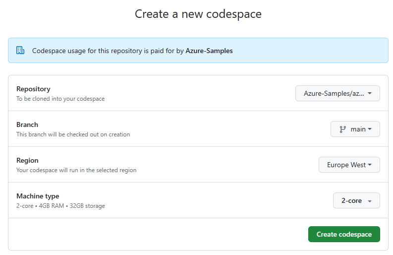
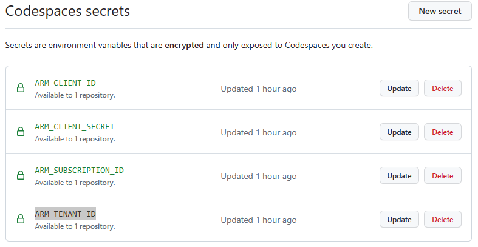

# Azure OpenAI Terraform deployment for sample chatbot

This sample application deploys an AI-powered document search using Azure OpenAI Service, Azure Kubernetes Service (AKS), and a Python application leveraging the [Llama index](https://gpt-index.readthedocs.io/en/latest/) ans [Streamlit](https://docs.streamlit.io/library/get-started). The application will be deployed within a virtual network to ensure security and isolation. Users will be able to upload documents and ask questions based on the content of the uploaded documents.

## Prerequisites

- Azure subscription. If you don't have an Azure subscription, [create a free account](https://azure.microsoft.com/free/?ref=microsoft.com&utm_source=microsoft.com&utm_medium=docs&utm_campaign=visualstudio) before you begin.
- Subscription access to Azure OpenAI service. Request Access to Azure OpenAI Service [here](https://customervoice.microsoft.com/Pages/ResponsePage.aspx?id=v4j5cvGGr0GRqy180BHbR7en2Ais5pxKtso_Pz4b1_xUOFA5Qk1UWDRBMjg0WFhPMkIzTzhKQ1dWNyQlQCN0PWcu).
- [Terraform](https://learn.microsoft.com/azure/developer/terraform/quickstart-configure).

The easiest way to run this sample is to run it with [GitHub Codespaces](https://github.com/codespaces)

## Quickstart

### (Optional) configure GitHub Codespaces secrets to access your Azure subscription

- Run the following command to create a service principal with the "Owner" role for a specific subscription, and outputs its information in JSON format.

    ```bash
    az ad sp create-for-rbac --role="Owner" --scopes="/subscriptions/<SUBSCRIPTION_ID>" -o json
    ```

- In your github account go to Codespaces and Create a new Codespace with "Azure-Sample/azure-openai-terraform-deployment-sample" repository and select the main branch.

    

- In your github account, go to Settings. On the left pane, select Codespaces tab and create a secret for `ARM_CLIENT_ID`, `ARM_CLIENT_ID`, `ARM_SUBSCRIPTION_ID` and `ARM_TENANT_ID` values, as shown in the image below. For each secret, on the Repository access section, click on the "Select repositories" dropdown menu and select "Azure-Sample/azure-openai-terraform-deployment-sample".

    

- Open your [GitHub Codespace](https://github.com/codespaces).

### Run the Terraform

- Clone or fork this repository. (Skip if using GitHub codespaces)
   ```
   git clone https://github.com/Azure-Samples/azure-openai-terraform-deployment-sample/
   cd azure-openai-terraform-deployment-sample
   ```

- Go to the `infra` folder and run the following command to initialize your working directory.

    ```bash
    cd infra
    terraform init
    ```

- Run terraform apply to deploy all the necessary resources on Azure.

    ```bash
    terraform apply
    ```

- Run the following command. This script retrieves the AKS cluster credentials, logs in to the ACR, builds and pushes a Docker image, creates a federated identity, and deploys resources to the Kubernetes cluster using a YAML manifest.

    ```bash
    terraform output -raw installation-script | bash
    ```

- Get the external ip address of the service by running the  command bellow.

    ```bash
    kubectl get services -n chatbot
    ```

- Copy the external ip address and paste it in your browser. The application should load in a few seconds.


## Resources

- [Azure OpenAI](https://learn.microsoft.com/en-us/azure/cognitive-services/openai/overview)
- [Azure OpenAI Terraform verified module](https://registry.terraform.io/modules/Azure/openai/azurerm/latest).
